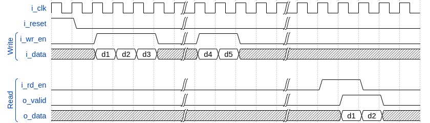

# sync_fifo

Single clock synchronous FIFO with native interface. VHDL and Verilog versions.

### Catalogs structure:
- **doc** - documents, images and others files;
- **sync_fifo_verilog** - sync_fifo verilog version;
  - **hdl** - verilog files;
  - **sim** - script files for modelsim/questasim;
  - **tb** - testbenches;
- **sync_fifo_vhdl** - sync_fifo vhdl version;
  - **hdl** - vhdl files;
  - **sim** - script files for modelsim/questasim;
  - **tb** - testbenches.

:exclamation: To set the FIFO depth and width, you must specify **FIFO_DEPTH** and **DATA_WIDTH** parameters
in the top project file (**sync_fifo.vhd** or **sync_fifo.v**).

### Write and Read operations:
